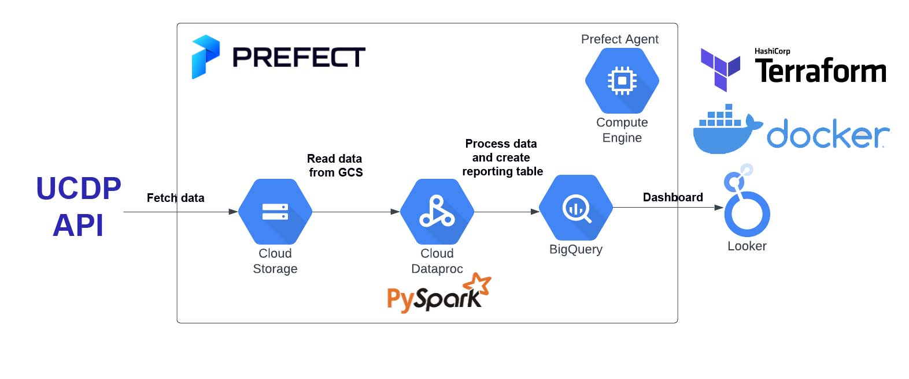
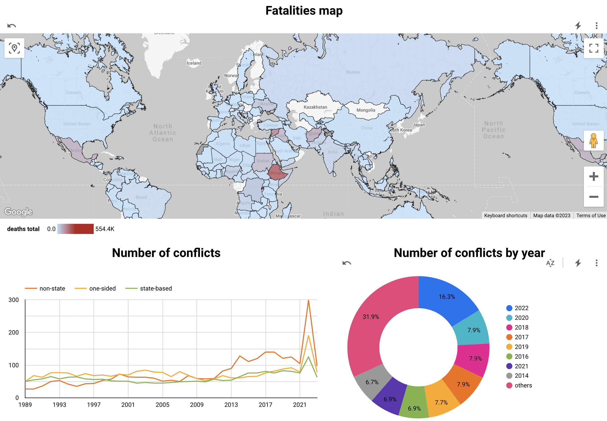

# ucdp-org-violence


## Project overview
This project is analyzing the organized violence data collected by Department of Peace and Conflict Research of Uppsala University.
The project entails end-to-end orchestrated data pipeline. The conflict data is obtained in batches from the [UCDP API](https://ucdp.uu.se/apidocs/) and saved to Google Cloud Storage in parquet format. Afterwards, the data is processed in pyspark by Dataproc cluster and pushed to BigQuery table which acts as a data source for the Looker dashboard.
Follow the steps mentioned under `How to run it` to reproduce it.

## What is UCDP?
The Uppsala Conflict Data Program (UCDP) is the world’s main provider of data on organized violence and the oldest ongoing data collection project for civil war, with a history of almost 40 years. Its definition of armed conflict has become the global standard of how conflicts are systematically defined and studied.(https://www.pcr.uu.se/research/ucdp/)


## Problems that have been addressed 
1. Identify number of individual events of organized violence in the world in past years
2. Regions that suffered the most from armed conflicts / violence
3. Number of fatalities caused by conflicts

## Technologies
- Cloud: `Google Cloud`
- Infrastructure: `Terraform`
- Orchestration: `Prefect`
- Data lake: `Google Cloud Storage`
- Data processing: `Dataproc`
- Data warehouse: `BigQuery`
- Data visualization: `Google Looker Studio`



## Dashboard 
[Click here](https://lookerstudio.google.com/s/rTWuX39b4nI) to see Looker dashboard.



## How to run it

1. Create a virtual env and install all required dependencies. Example with conda:
```bash
conda create --name venv
conda activate venv
conda install pip
pip install -r requirements.txt
```
2. Setup your Google Cloud environment
- Create a [Google Cloud Platform project](https://console.cloud.google.com/cloud-resource-manager)
- Configure Identity and Access Management (IAM) for the service account, giving it the following privileges: Owner, BigQuery Admin, Dataproc Admin, Compute Admin, Compute Storage Admin, Storage Admin and Storage Object Admin
- Enable BigQuery, Compute, Dataproc and Storage APIs
- Download the JSON credentials and save it in terraform folder, e.g. to `src/terraform/<credentials>.json`
- Install the [Google Cloud SDK](https://cloud.google.com/sdk/docs/install-sdk)
- Authenticate the service account
```bash
gcloud auth login --cred-file=terraform/<credentials>.json
gcloud config set project <project_id>
```

3. Setup your infrastructure
- Install Terraform (https://developer.hashicorp.com/terraform/downloads)
- To initiate, plan and apply the infrastructure, adjust and run the following Terraform commands
```bash
cd terraform/
terraform init
terraform plan -var="project=<project_id>"
terraform apply -var="project=<project_id>"
```

4. Orchestration
- Congigure and launch prefect
```bash
prefect config set PREFECT_API_URL="http://127.0.0.1:4200/api"
```
```bash
prefect orion start
```
- In a new terminal window create prefect blocks from prefect directory 
```bash
cd prefect/
python blocks/blocks.py
```
- Start prefect agent
```bash
prefect agent start -q 'default'
```
- In a new terminal window deploy the first job (uploading files to GCP Storage)
```bash
cd prefect/
python flows/deploy_file_upload.py
```
- Run deployment to ingest data for 2022 conflicts
```bash
prefect deployment run upload_files/file_upload_flow -p "year=22"
```
- Run deployment to ingest data for 2023 conflicts (Jan,Feb)
```bash
prefect deployment run upload_files/file_upload_flow -p "year=23" -p "months=[1,2]"
```
- Deploy and run a new job to ingest data from the API (years 1989-2021)
```bash
python flows/deploy_api_gcs.py
```
```bash
prefect deployment run etl_gcs/api_request_flow
```

5. Data processing
- Start dataproc cluster
```bash
gcloud dataproc clusters start <dataproc_cluster_name> --region=<region>
```
- Wait 1-2 minutes for the cluster to start and submit pyspark job to the cluster
```bash
gcloud dataproc jobs submit pyspark --cluster=<dataproc_cluster_name> --region=<region> --jars=gs://spark-lib/bigquery/spark-bigquery-latest_2.12.jar \
    job.py -- --input_georeferenced=gs://<data_lake_bucket>/data/ucdp/georeferenced/*/ --input_candidate=gs://<data_lake_bucket>/data/ucdp/candidate/*/ --gcs_bucket=<data_lake_bucket> --output=gs://<data_lake_bucket>/data/ucdp/output/*/ --output_table=<project_id>.<BQ_DATASET>.report
```

6. Data for the report
- The data will be available in BigQuery at '<project_id>.<BQ_DATASET>.report'